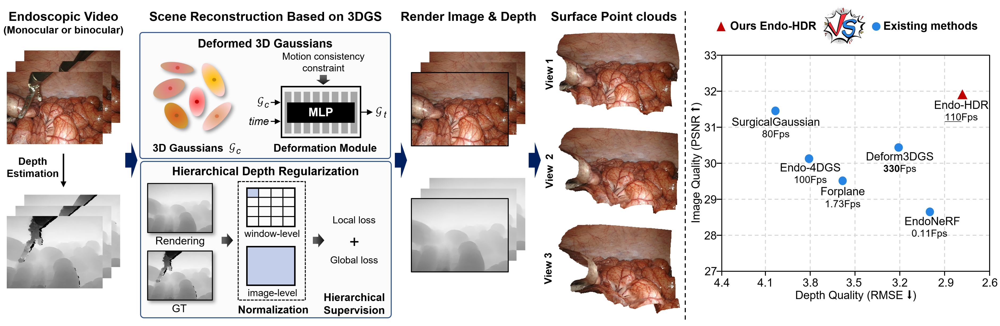

# Endo-HDR: Dynamic Endoscopic Reconstruction with Deformable 3D Gaussians and Hierarchical Depth Regularization

### [Project Page](https://endo-hdr.github.io/)


-------------------------------------------


## Environment
Please follow the [3D-GS](https://github.com/graphdeco-inria/gaussian-splatting) and [4DGS](https://github.com/hustvl/4DGaussians) to install the relative packages.
```bash
git clone https://github.com/Endo-HDR/Endo-HDR.git
cd Endo-HDR

conda create -n Endo-HDR python=3.7 
conda activate Endo-HDR

# install pytorch and others.
pip install torch==1.12.1+cu113 torchvision==0.13.1+cu113 torchaudio==0.12.1 --extra-index-url https://download.pytorch.org/whl/cu113
pip install -r requirements.txt
# You also need to install the pytorch3d library to compute Gaussian neighborhoods.

# You can follow 4DGS to download depth-diff-gaussian-rasterization and simple-knn.
pip install -e submodules/depth-diff-gaussian-rasterization  
pip install -e submodules/simple-knn
```

## Dataset
**EndoNeRF Dataset:**  
The dataset from [EndoNeRF](https://github.com/med-air/EndoNeRF) is used, which can be downloaded from their website. We use the clips 'pulling_soft_tissues' and 'cutting_tissues_twice'.

**StereoMIS Dataset:**  
The dataset provided in [StereoMIS](https://zenodo.org/records/7727692) is used. We use the clips 'p2-7' and 'p2-8'. 

**Hamlyn Dataset:**  
The dataset provided in [Hamlyn](https://davidrecasens.github.io/EndoDepthAndMotion) is used. We extract seven specific sequences on this dataset following [Forplane](https://github.com/Loping151/ForPlane). The resulted file structure is as follows.
```
├── data
│   | EndoNeRF 
│     ├── pulling
│     ├── cutting 
│   | StereoMIS
│     ├── intestine
│     ├── liver
│   | Hamlyn
│     ├── seq_1
│     ├── seq_2
│     ├── ...
```


## Training
For surgical scene `pulling_soft_tissues`, run 
``` 
python train.py -s data/EndoNeRF/pulling -m output/endonerf/pulling --config arguments/endonerf/pulling.py 
``` 

## Rendering
Run the following script to render the images.  

```
python render.py -m output/endonerf/pulling
```


## Evaluation
Run the following script to evaluate the model.  

```
python metrics.py -m output/endonerf/pulling
```

---
## Acknowledgement


Some source code is borrowed from [3DGS](https://github.com/graphdeco-inria/gaussian-splatting), [4DGS](https://github.com/hustvl/4DGaussians), and [Deformable-3D-Gaussian](https://github.com/ingra14m/Deformable-3D-Gaussians/tree/main). Thanks for their excellent code.

